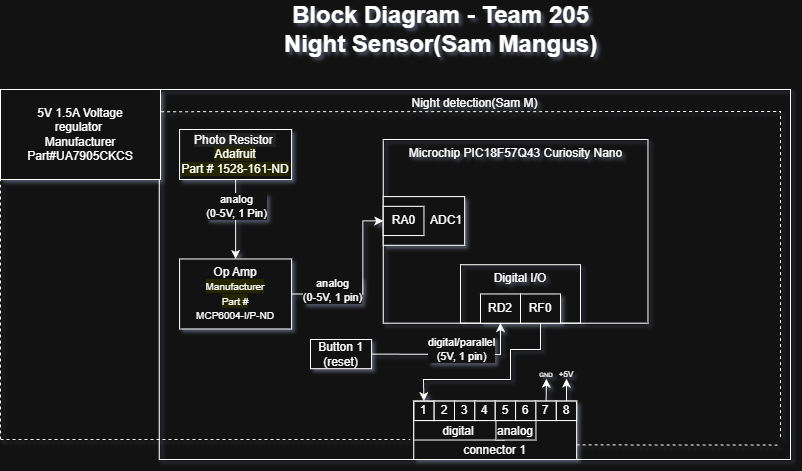

## Overview
My voltage will be 5V all around and will be using a photo resistor to detect the lux and the analog output will be amplified by the op-amp which will then be transmitted to the ADC pin of the pic to be turned into a digital signal that will go to our control board and determine if the light should be turned on. 

## Block Diagram 

[Block Diagram](https://viewer.diagrams.net/?tags=%7B%7D&lightbox=1&highlight=0000ff&edit=_blank&layers=1&nav=1&title=Untitled%20Diagram.drawio&dark=auto#R%3Cmxfile%3E%3Cdiagram%20name%3D%22Page-1%22%20id%3D%22ztoAM4M2pOlv_ggdo6h-%22%3E5Vxbc6M4Fv41ruo8mJLExfCY2Em2a%2FqS7cz2zuzLFDHEpoORB%2BMk7l8%2FEkhYQjIG2zikN66ULSGE9J2jc9NBA3O8eL1N%2FeX8Mw7CeIBA8DowJwOEIHIh%2BaI1m6LGdlBRMUujgDXaVtxHP0NWCVjtOgrCldQwwzjOoqVcOcVJEk4zqc5PU%2FwiN3vEsfzUpT8LlYr7qR%2Brtf%2BNgmxe1Lo22Nb%2FK4xmc%2F5kCNiVhc8bs4rV3A%2Fwi1BlXg%2FMcYpxVvxavI7DmILHcSnuu9lxtRxYGiZZkxv%2B%2FnF9%2B%2FWj%2BTT6NEb%2FS%2F56%2BuK9mEPkFd08%2B%2FGazZiNNttwCGYpXi8H5tVjFMdjHOOUVCc4IVev1DHI5PAfeCcMhOcwzcJXoSkb622IF2GWbkgTdhWZ7JZNiWxRftmSwXZY3VwggTlilT4j%2Fazse4sO%2BcEAagEWH5EA1pf8uYS9w4xMN8LJh3t%2FQcqfLxQYCYpJENL%2BAUHuZR5l4f3Sn9KrL2TtkLp5tiDjmUA91hS6iDDmZRzNElKd4aWWAvV0boz%2FcAQNNBI%2FCvyOKTcxz0oMqBDjczRN8XQeLUn13ccxdG%2Fs0b8tMiowXqcRXkUZnd8XP8HHEUdPCQ3JFviZrQB6Wxquop9iGWd%2BJpSJ6AzFchhEYjHG06dyhPL6gl0yArSRIfEBktalrS5L5FiGhnNEvoCuaThuV6yBFNaYRDMCJr3zI%2Bny63tfnIpwHNkGchRCQKSRj7ZrWKgr5E0F2TAg%2BpQVcZrN8Qwnfny9rb2Ssd%2B2%2BYQpiDniP8Is2zDjwF9nWKYHQTfd%2FMHuzwt%2F0oJh8%2BLkVbw42bDSKvPT7JIaCVtC5nU3EZ12ccdrlP3Bn0N%2BCz2T0rZjWuD9tiT7Cq%2FTaVjT0GYNydBmYV2PplU0pJjXslEaxn4WPcs2jo4b2K13OEqyxiIBOrZhU%2B1gj1zPGpkjuf9iGqxL0WCpPgUhA7rCx5GfYjpG%2BQjHtSz5KQWqylMIuf2N0GxJG6xqpmoiw3SEjy0NAgG7fg71t0OmxbZrrhjfdgWWRDtiUVqKOLycjOFxMtBngi4tBMubqR8IRgYEArdZihR0oWHZwsdSZaLlEm1kobIjryv56CikGCAnpgAG0TP5OaM%2Fv03KWvIU4cJxJOtOG9myNkLAMizVXLQ0ygh5Rp34OQ5sVwH7ap1lOCF1UAP7B2KghdnFu4J%2B5Bmep5rgnBBWfplLSI60aMJDA3jCx91BInGFOV3RS%2FVFv92AngKPvF7yvKV6Rd8u%2B4rhPtEOHUMjlCV0tfe%2FCfdatka0ayMp7eA8PpJCfS0JJdkGMSE0bEFGAFWDQgcZkpTQiIncrRCQtrvCWVWhDCLij%2BWC%2FZSu%2FQMmCmPRfBGUXLCfOn3Fd6TgG3Dn%2BZ0gy%2BWHp5PInkYiCy1Pj6dqhfjEucWzdwMnu%2BpSb0wW0AQ2t5HK6xRg1Ww4UgisshQ%2FhTzCE9NpDAM%2FffowQCbI%2FwaIjNW8yf8u9BGhWeoHEaHB3oj5CeUIArKz6eyghCk6Ox2RxVaD5apC7MIOac%2FZO2DrK7CqiadG3foB7A77rK%2FAIgVYq6fAVt02Vc31ClhTAdbuKbA7YkV9BVaN7Dk9BRYCaIixXNVu6BWwqjM36iuw1Sh5z1lWdd%2FcviJrIUOUBVyM9RVZ1XHTBDl51WrpJxLozt9rmolyNS3s1UtyUbB809nDh8LqBfzrovimVxBdL7Qg%2Fri4yB8HHvzp0yyn6FDoO7%2BN4pW3Fn4Ud%2FHR8GHfzXGGSYNv4Spa5Z5%2BGaQtZvKuZ0e%2B%2FQVl6%2BRhtRSmsWN21ch0eyLrR11BRJ03BEjAhe7r0d%2F8G3BMTg1yFa7LwH9M11F2KpiOR64GLi03%2ByndIxxQw12mPLSRO4QOHH6ZHDS7d7FpQXxDKdzlMY9mIwcQxAAZhIYn%2FamC1u4q08hWFdRZkxq2eQx%2FDsQ0Bn1SQ0uq7U8%2BYGplb%2FIBz1I4XfLBcVTTZTYq6%2F0rzRW7JCvwBDLj7GKEP%2BUR5ykH6lPoheEq57DLvKPlq7ajz36yfvSn2ToNRc1a9KsImHOqpLdCRJLQJ8OjMUp8%2FDwdmg8Pamg3vnMAsIY0r%2B1OVhs7xvuLqg3oaOP9TVRHZ0mqjhoEVXVJEvActGnsr1bRVMZTBv%2BQfLRdqqRUM2dSJTwhY38em3NqVXJYcpczKrMq96SVKV2jyi4rapgF1zY%2FreTdcsxSQlo3GWWOGoL%2B5D%2BE6g4hJWBxRU5%2FBhWRsc0nmxJeI0pI3eBaREEQt9hB4UvviP3z8xgq%2FIUYAczfw9esFktNIt5%2B4KoEYKxFOrevBvbkrNCyq8AAPOrO%2BbcoHbqweRP8%2BLgKM4U2p%2BB9NZhd7o%2FfEOj8OKYLQc0us78z44VCHCVN88x%2BTbJDKJPd7jvZR2qonW%2Fjq6QGQ5HYd4cR%2B8zy8nT5Rra8N%2BXJVhpN6jIFa6yrtIDR7ryLghQPaY0hXiHhu1yvJ8wgo5s3FTkNurKZXdW4UEHe2swsryLwV%2FPcSIZ11nNL5Pban%2BK7iLpXbcBxYo07PtXXfcxqrKupVQrdPR3tsEpPJUVdVYqejLZ6z2jU2DXyyOCk14c8Z5%2BDlJfuwjQiuNBF3YnXxBMe93tNoFdcC6sZ0ocybRkQ3iV6umZa3UsbJ2ZaYggDU2Jc4NQzLil0zXm%2FKkPZ9mFSsK1vXn0O45tTuebfAYDh7Ro%2B%2FmZ9v95Yyxf00xu2U54tAk7bIFMZOmodcDr33gV%2Fo2Sv6LT6pfBRRU2X5daisxIdMmE3nF72W0ahQP24qhNs296rbw89s6790Uvv3nyYfPzx1%2B3Q%2BXQ9nv9YP9wHhC3Ps%2FTAQUvv3LFeW2O1aFEze7XyYMXSRtUFc6ilDZ3OjJY6WDW7n033xtwdW2MDdEVd4x27TBWGz2gkU2Jx3e6RnHDPDChNTn0LJ%2FoYt6%2B5Y2wieQ%2BKvo%2BpecvS1DBslbEO8Z%2B1lNe5WO0o7%2Byg%2FG3N7uL%2FGd2BrQRE6PsxCuV1B3BYJ3n9U0v7Bu8gnlcFFV5MqYQMxyud7Lf0qXl%2B717t1PRAjTPZhdXNPu9A7WSiSkdWZ9pJH5xVc1Xz841I1STyZ2l%2BhtaQ%2FP8e5j%2FzYzaUIC0%2FfOs%2BTFY45Sdv%2BclsvWoarWVyqqkgEg8BIuKPJW8hi5dZx7oX9EoRpQgzlbm5E9dcHlVcY65wxDwIoBNFnQVxVWOYGg0AGjbVMN9xnNGD91SapuFsTdZInuG7Kye2PodmRzJT%2FU1Fvo%2F5n8uRB%2Bzxb%2BP782TGNCd0zSl4UHcKXlUynI6y7XRMu2iY9iCn9q4LPyhyn9vPufStxTtPfK36CE3FuXWgm79fnJPi9oTKovn2nE%2Fz%2Bh8%3D%3C%2Fdiagram%3E%3C%2Fmxfile%3E)

## Team product requirements

My portion of the project helps meet product requirements by using an analog signal that can be activated hands free so the user has a easy experience. The way my subsystem accomplishes this is by using a photoresistor that will be able to detect when it's dark in the environemnt then communicate that to our control board the will trun the light on automatically.