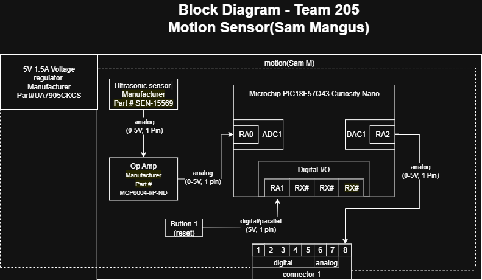

## Overview
My voltage will be 5V all around and will be using a ultrasonic sensor to detect motion as part of our teams light that will be actiavted by different inputs. 

## Block Diagram 
Showing an example of how to import a screenshot of the block diagram created outside of git and brought into a page.

(https://app.diagrams.net/#G1rQFn4Sh_jxuRcLE5AkU6wQEz31pbD2Ht#%7B%22pageId%22%3A%22ztoAM4M2pOlv_ggdo6h-%22%7D)