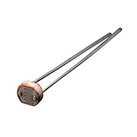
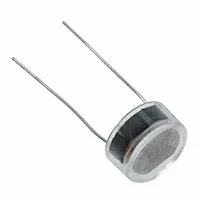
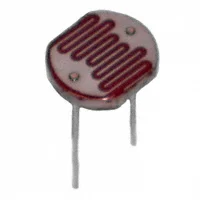
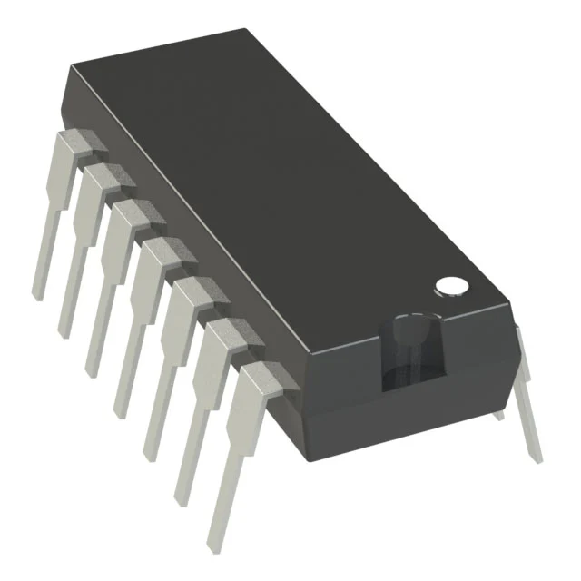
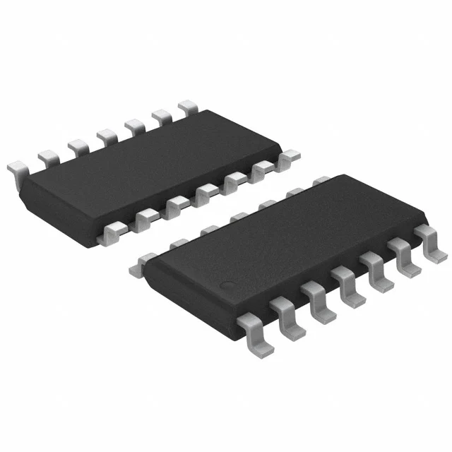
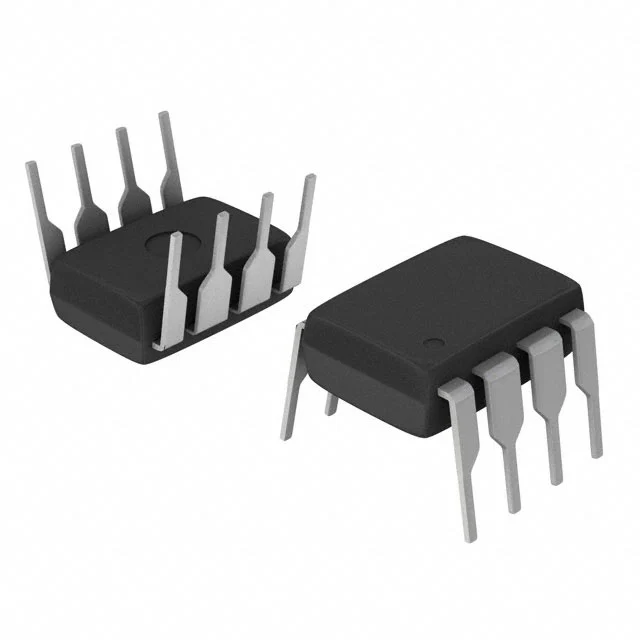
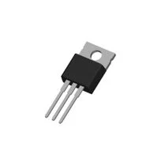
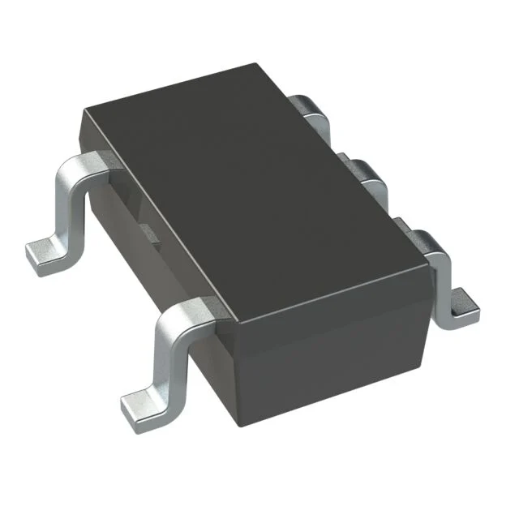
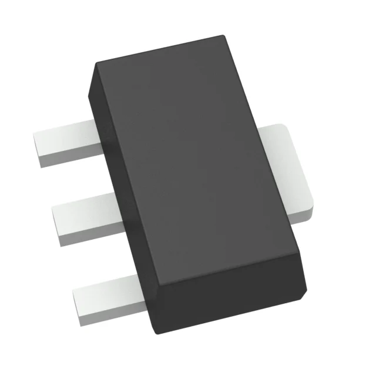

**Photo Resistor**

1. 	1528-161-ND 

    

    * $.95/each
    * [Photo resistor](https://www.digikey.com/en/products/detail/adafruit-industries-llc/161/7244927)

    | Pros                                      | Cons                                                             |
    | ----------------------------------------- | ---------------------------------------------------------------- |
    | 200k to 10k resistance range                               | More expensive |
    | Works witha power supply up to 100V                      | Larger footprint                                        |
    | Comprehensive datasheet |

1. 	NORPS-12-ND 

    

    * $2.23/each
    * [Photo resistor](https://www.digikey.com/en/products/detail/advanced-photonix/NORPS-12/5039796)

    | Pros                                                              | Cons                |
    | ----------------------------------------------------------------- | ------------------- |
    | Larger detection range                                          | Significantly more expensive      |
    | Up to 1M ohm resistance                                 | Slow shipping speed |
    | -30-70 C operating temprature |

1. 	PDV-P5001-ND 

    

    * $1.54/each
    * [Photo resistor](https://www.digikey.com/en/products/detail/advanced-photonix/PDV-P5001/480599)

    | Pros                                                              | Cons                |
    | ----------------------------------------------------------------- | ------------------- |
    | 400-700 nm detection range                                          | Largest footprint      |
    | 350V peak to peak                                 | Shipping time |
    | up to 300k ohm resistance |

**Choice:** Option 1: 1528-161-ND

**Rationale:** The price is the lowest of the three and while it's performance is worse than the other two it is still more than sufficient for this project and will be the easiest to obtain

**Op-Amps**

1. MCP6004

    

    * $0.59/each
    * [MCP6004](https://www.digikey.com/en/products/detail/microchip-technology/MCP6004-I-P/523060?s=N4IgTCBcDaILIGEAKA2ADGgLAWgJIHolsA5AERAF0BfIA)

    | Pros                                      | Cons                                                             |
    | ----------------------------------------- | ---------------------------------------------------------------- |
    | 1.8-6V operating range                               | Not extremely precise |
    | Designed for low power applications                      | Limited bandwidth                                        |

1. 	LM324ADR IC Op-Amp

    

    * $0.30/each
    * [LM324ADR](https://www.digikey.com/en/products/detail/texas-instruments/LM324ADR/381227)

    | Pros                                                              | Cons                |
    | ----------------------------------------------------------------- | ------------------- |
    | Less expensive                                          | Poor noise performance      |
    | Wide working voltage range                                 | Smaller temprature range |
    | Easy to obtain |

1. 	296-1395-5-ND Op-Amp

    

    * $0.27/each
    * [LM358P](https://www.digikey.com/en/products/detail/texas-instruments/LM358P/277042)

    | Pros                                                              | Cons                |
    | ----------------------------------------------------------------- | ------------------- |
    | Least expensive                                          | 2 integrated op-amps      |
    | Fast shipping                                 | Higher supply current |

**Choice:** Option 1: MCP6004-I/P-ND Op-Amp

**Rationale:** It supports a low supply volatge while still offering 4 op-amps and has rail to rail input and output. the MCP6004 also draws low current and the pins are spaced standardly making it's footprint easy also it is moderately priced and easy to obtain making it the best overall pick.

**Volatge regulator**

1. 	5536-LM7805T-ND IC REG LINEAR

    

    * $0.33/each
    * [LM7805](https://www.digikey.com/en/products/detail/taejin/LM7805T/22237260)

    | Pros                                      | Cons                                                             |
    | ----------------------------------------- | ---------------------------------------------------------------- |
    | 1.5A output current                               | Possible overheating |
    | Simple 3 pins                      | Fixed 5V output voltage                                        |

1. 	TC1014-3.3VCT713TR-ND

    

    * $0.30/each
    * [TC1014](https://www.digikey.com/en/products/detail/microchip-technology/TC1014-3-3VCT713/443111)

    | Pros                                                              | Cons                |
    | ----------------------------------------------------------------- | ------------------- |
    | Good temprature range                                          | Output current limited to 50 mA      |
    | Low power consumption                                 | Fixed 3.3V output |
    | Small footprint |

1. 	AS78L05RTR-E1DITR-ND

    

    * $0.13/each
    * [AS78L05RTR](https://www.digikey.com/en/products/detail/diodes-incorporated/AS78L05RTR-E1/4470943)

    | Pros                                                              | Cons                |
    | ----------------------------------------------------------------- | ------------------- |
    | Least expensive                                          | 100 mA output      |
    | 5V output                                 | Poor heat dissipation |

**Choice:** Option 1: 296-17077-ND IC REG LINEAR

**Rationale:** It is easy to integrate into the project with a simple 3 pin layout and still relatively small footprint. It also outputs the most current and is tied with option 3 for 5V output it is the best overall option for this project.

**Major components selected**

1. 	OP-AMP: MCP6004

    

    * $0.59/each
   * [MCP6004](https://www.digikey.com/en/products/detail/microchip-technology/MCP6004-I-P/523060?s=N4IgTCBcDaILIGEAKA2ADGgLAWgJIHolsA5AERAF0BfIA)

1. 	Photo resistor: 1528-161-ND 

    

    * $.95/each
    * [Photo resistor](https://www.digikey.com/en/products/detail/adafruit-industries-llc/161/7244927)

1. 	Voltage regulator: 5536-LM7805T-ND IC REG LINEAR

    

    * $0.33/each
    * [LM7805](https://www.digikey.com/en/products/detail/taejin/LM7805T/22237260)

