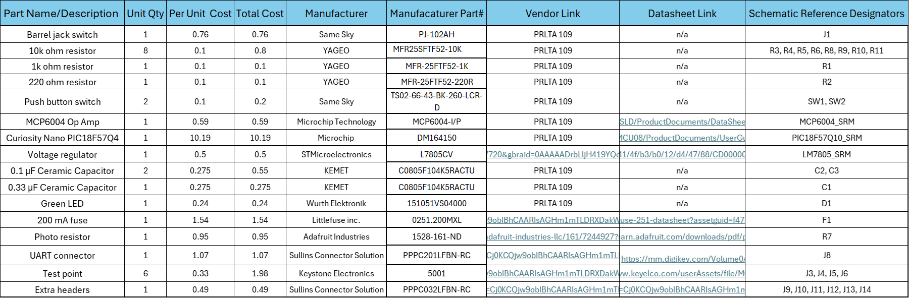

## Overview
The BOM previews the overall cost for the project and list out each specific part with its price per unit how many are used and links to the manufacturers datasheet and links to the vendors if available.

## Bill of Materials
{style width: "2000"}
**Figure 2:** 

