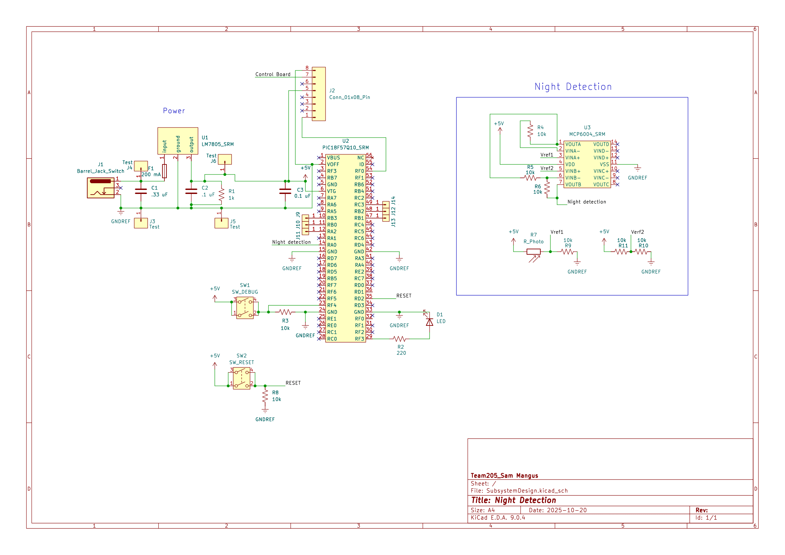

## Overview

This schematic is design to support our automated light by detecting lux and prompting the light to turn on when it is night time.

{style width:"350" height:"300;"}
**Figure ##:** 

## Resources

The schematic as a PDF download is available [*here*](SubsystemDesign.pdf), and the Zip folder of the project [*here*](SubsystemFinal.zip).