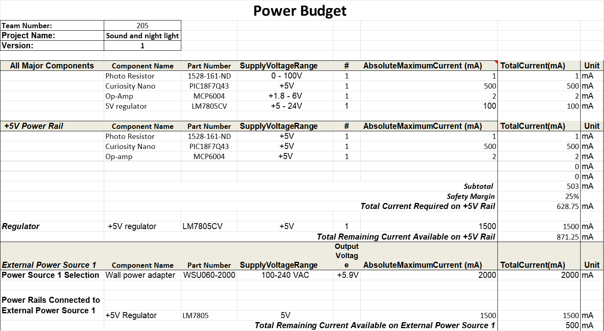

## Overview
This power budget takes into account all major components of the subsytem and ensures that power suply and voltage regulator can safely provide enough current. 

> Capture your power budge as a image to display. Take time to get clean breaks and a well organized layout.

{style width:"350" height:"300;"}

## Conclusions

From the prepared Power Budget, I can safely move on knowing the chosen power supply and voltage regulator meet the current requirements for my circuit.

## Resources

The power budget as a PDF download is available [*here*](PowerBudget.pdf), and a Microsoft Excel Sheet [*here*](PowerBudget.xlsx).