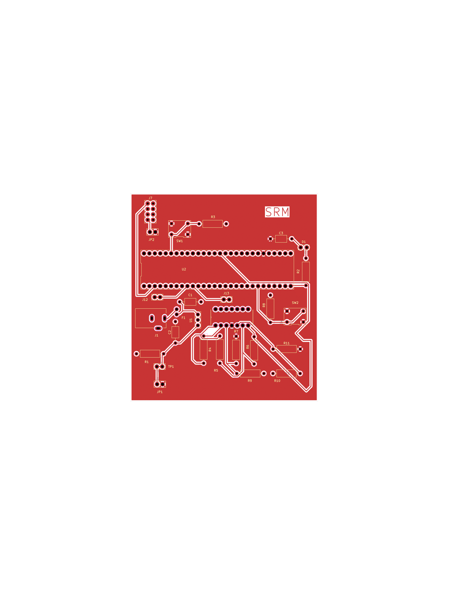
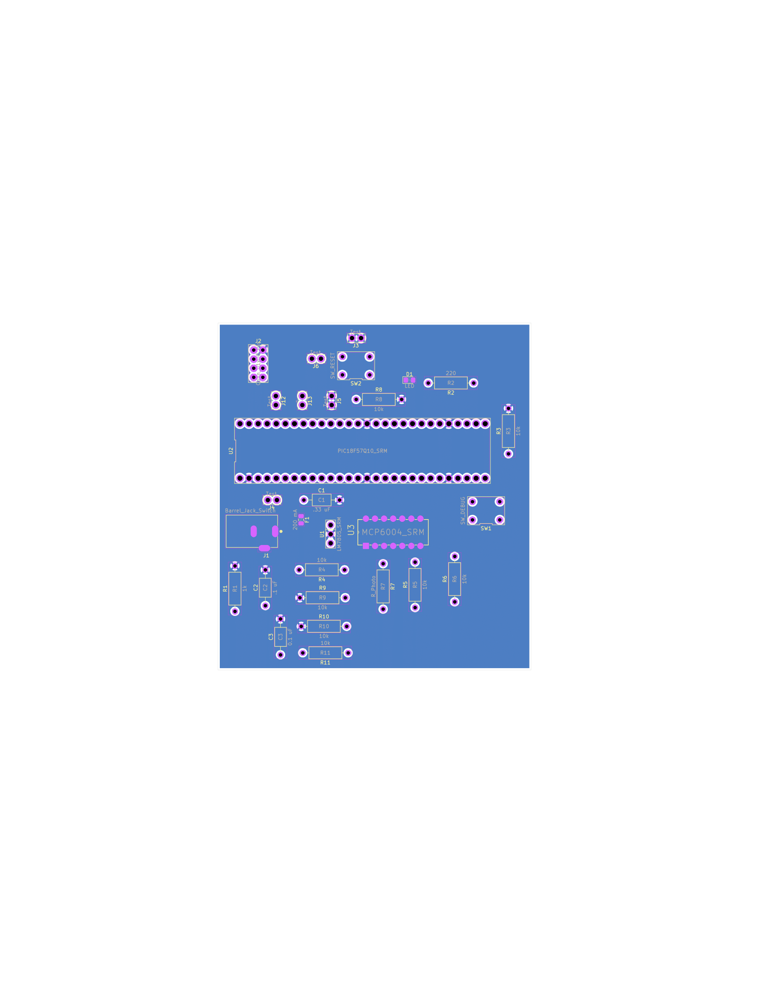

## Overview

This PCB will help manufacture a board that can be used for our project and serve its functionality.

**Figure 1:PCB top layer** 
{style width:"350" height:"300;"}

**Figure 2:PCB top layer** 
{style width:"350" height:"300;"}

## Resources

The PCB top layer as a PDF download is available [*here*](PCBtop.pdf), and the PCB bottom layer as a PDF download is available [*here*](PCBbottom.pdf). Also the Zip folder of the project is available [*here*](SubsystemDesign.zip).